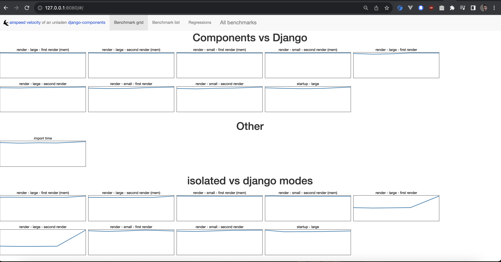

Benchmarking your package across releases
=========================================

``asv`` allows you to track the performance of your package across releases.

In this tutorial we will implement that with:

* ``git`` for the source control
* GitHub for the repository
* GitHub Actions for CI/CD
* ``asv v0.6.4`` as the benchmarking tool
* ``main`` as the base branch

The result will look like this:

Overall, this workflow can be broken down into four steps:

1. When a tag is pushed to the repository, or when you make a release, this triggers a Github Action workflow.
2. The workflow runs the benchmarks for the release.
3. The generated benchmark results are pushed to the source control as a new commit.
4. Display the benchmarking across releases.

1. Setup ``asv``
-------------------

Install ``asv`` in your project.

.. code-block:: bash

   pip install asv

And setup ``asv``:

.. code-block:: bash

   asv quickstart

This will create a ``asv.conf.json`` file in your project, as well as a ``benchmarks`` directory with some example benchmarks.

Next head over to ``asv.conf.json`` and configure the dependencies and Python version you want to use.

2. Write your benchmarks
-------------------------

For the purpose of this tutorial, we will go ahead with the benchmarks generated with ``asv quickstart``.

After you have written your benchmarks, check that they work:

.. code-block:: bash

   asv run HEAD^! -v -e

This will generate benchmark results as JSON files. These files will be saved in a directory as specified in the ``results_dir`` field in the ``asv.conf.json`` file.

By default, this is ``.asv/results``.

.. note::

   What does ``HEAD^!`` mean?

   We're using ``asv`` with git, and so the argument to ``asv run`` is a git range.

   * ``HEAD`` means the "current branch".

   * ``^`` means that we mean the COMMIT of the branch, not the BRANCH itself.

     * Without ``^``, we would run benchmarks for the whole branch history.
     * With ``^``, we run benchmarks FROM the latest commit (incl) TO ...

   * ``!`` means that we want to select range spanning a single commit.

     * Without ``!``, we run benchmarks for all commits FROM the latest commit
       TO the start of the branch history.
     * With ``!``, we run benchmarks ONLY FOR the latest commit.

To check that the results are correct, start-up a local web server with:

.. code-block:: bash

   asv publish
   asv preview

This will start a local web server on port 8080.

3. Trigger benchmarks on release or git push
--------------------------------------------

Now that the benchmark tests are prepared, we can move on to setting up GitHub Actions.

Paste the following in ``.github/workflows/release-benchmark.yml``:

.. code-block:: yaml

   name: Release benchmarks
   on:
     push:
       tags:
         # for tags with semver format (e.g. v1.0.0 or 1.0.0)
         - 'v?[0-9]+.[0-9]+.[0-9]+'
       branches: 
         - main
     workflow_dispatch:

   jobs:
     benchmarks:
       runs-on: ubuntu-latest
       steps:

         ##############################
         # SETUP
         ##############################

         - name: Checkout
           uses: actions/checkout@v4
           with:
             fetch-depth: 0

         - name: Set up Python
           uses: actions/setup-python@v5
           with:
             python-version: "3.13"
             cache: 'pip'

         - name: Install asv
           run: |
               python -m pip install --upgrade pip wheel
               python -m pip install asv

         - name: Configure git
           run: |
             # Get the main branch so we can run benchmarks on it
             git remote add upstream https://github.com/${{ github.repository }}.git
             git fetch origin main:main
             git checkout main

             # So we an identify the commits that were made
             git config user.name github-actions
             git config user.email github-actions@github.com

         ###########################################
         # RECORD BENCHMARKS
         ###########################################

         - name: Run benchmarks for tag
           run: |
             # Get tag name
             TAG=${GITHUB_REF#refs/tags/}
             echo "TAG: $TAG"

             # Prepare the profile under which the benchmarks will be saved.
             # We assume that the CI machine has a name that is unique and stable.
             # See https://github.com/airspeed-velocity/asv/issues/796#issuecomment-1188431794
             echo "Preparing benchmarks profile..."
             asv machine --yes --machine ci-linux
             echo "Benchmarks profile DONE."

             # Run benchmarks for the current tag
             # - `^` means that we mean the COMMIT of the tag's branch, not the BRANCH itself.
             #       Without it, we would run benchmarks for the whole branch history.
             #       With it, we run benchmarks FROM the tag's commit (incl) TO ...
             # - `!` means that we want to select range spanning a single commit.
             #       Without it, we would run benchmarks for all commits FROM the tag's commit
             #       TO the start of the branch history.
             #       With it, we run benchmarks ONLY FOR the tag's commit.
             echo "Running benchmarks for tag ${TAG}..."
             asv run main^! -v
             echo "Benchmarks for tag ${TAG} DONE."

             # Stage and commit benchmark results
             echo "Staging and committing benchmark results..."
             git add .asv/results/
             git commit -m "Add benchmark results for ${TAG}"
             echo "Benchmark results committed."
             git push origin main
             echo "Benchmark results pushed to main."

In summary, this workflow does the following:

* Fetches ``main``
* Runs benchmarks with ``asv run`` for the tag, which will generate the results in ``.asv/results``
* Commits the results in ``.asv/results`` to the ``main`` branch

.. note::

   Similarly to the previously seen ``HEAD^!`` argument, here we use:

   * ``upstream/main^!`` to benchmark the latest commit of ``main``
   * ``HEAD^!`` to benchmark the latest commit of the PR

4. Test the integration
-----------------------

To see the integration in action, merge the code above into your repository.

Then make a release (or push a tag). This should trigger the "Release benchmarks" workflow
and commit the results to the ``main`` branch.

Afterwards, you should be able to see the results when you open the ``asv`` dashboard with:

.. code-block:: bash

   asv publish
   asv preview

.. note::

   If you're using ``master`` instead of ``main``, then update the file above accordingly.
